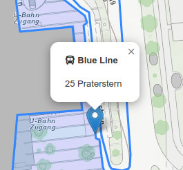
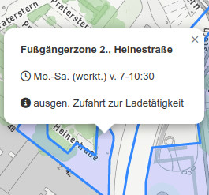
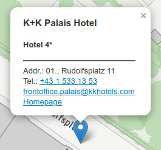

# Workload für die Woche vom 18. bis 25. April 2024

## Popups für die thematschen Layer beim Wien Beispiel

Implementiert nach den Vorgaben der Screenshots Popups für Haltestellen, Liniennetz, Fußgängerzonen und Hotels

 

 

Tipp: verwendet Font Awesome für die Icons wenn nötig ...

Bis spätestens **Donnerstag, den 25. April 2024 mittags** soll das fertige Beispiel unter https://usernmame.github.com/wien erreichbar sein
