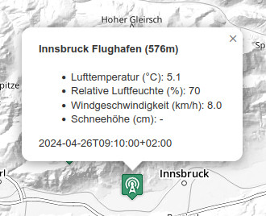

# Workload für die Woche vom 25. April bis 2. Mai 2024

## Wetterstationen Euregio Beispiel vorbereiten

1. erstellt auf github.com ein neues public Repo `aws`

2. cloned es lokal und packt das [AWS Euregio Template](https://webmapping.github.io/templates/template-aws.zip) dort aus

3. implementiert Icons für die Wetterstationen in der asynchronen Funktion `showStations`
    - verwendet das Icon `wifi` der [Map Icons Collection](https://mapicons.mapsmarker.com/)
    - wählt <https://clrs.cc> OLIVE als Icon-Farbe
    - speichert das Icon im `icons` Unterverzeichnis als `wifi.png`

4. erstellt Popups für die Stationen nach den Vorgaben des Screenshots

    

    - Tipp 1: nicht alle Stationen messen alle Werte, verwendet deshalb den Trick für fehlende Werte, den wir bei den Popups der Fußgängerzonen Wiens kennengelernt haben  ...
    - Tipp 2: die Seehöhe der Station verbirgt sich im Array `feature.geometry.coordinates` ...

5. pushed alles zurück zu github.com und macht das Repo über die Settings online verfügbar

Bis spätestens **Donnerstag, den 2. Mai 2024 um 12:00 Uhr mittags** soll das fertige Beispiel unter https://usernmame.github.com/aws erreichbar sein. Wir werden uns die Ergebnisse dann wieder ansehen und Feedback im OLAT-Kurs geben.
